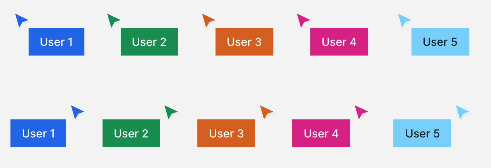

## Welcome to Collaboration Graphic Editor Demo

This project was created with:

- [Create React App](https://github.com/facebook/create-react-app)
- [Storybook](https://storybook.js.org/)
- Socket.io
- Node.js

Consider checking these links before starting the assignment:

- [Storybook Documentation](https://storybook.js.org/docs/basics/introduction/)
- [Storybook Guides](https://www.learnstorybook.com/)

# Assignment

The assignment consists of three parts:

- Implementing multiplayer cursors
- Implementing an object selection
- Implementing undo/redo function

 

# Part 1

Implement multiplayer cursors.

Add multiplayer cursor functionality to the provided "editor".

Consider taking a look at our [Figma](https://figma.com) [design file](.resources/AssignmentCursor.fig) to be able to inspect the component styles carefully.

> You'll need to download the design file and open it in figma, see [this help page](https://help.figma.com/hc/en-us/articles/360041003114-Import-files-into-Figma#Drag_and_Drop_Files) for more info.

 

## Requirements for this part

- Cursor for the current user shouldn't be shown
- If another user moves their cursor their name needs to be displayed next to the cursor. Name should persist for 3 seconds after the cursor stopped moving it. (feel free to use cursor id or any random name)
- If the name cannot be displayed on the right side of the cursor (e.g. cursor is next to the edge of the screen) name should be displayed on the left side. Consider other edge cases
- If cursor is not moving for more than 15 seconds it should fade out

## Server information

You are provided with the simple backend source code for this assignment, it already implements design updates. To complete this part you will need to implement the multiplayer cursors both on the backend and frontend.

## Resources

- [Design File](.resources/AssignmentCursor.fig)
- [Inter Font](https://fonts.google.com/specimen/Inter)
   

## Evaluation

Part 1 will be evaluated on the following criteria:

- Cursors match the provided design (colors, sizes, etc.)
- Cursors move smoothly even if the server responses are jittery or delayed
- Aforementioned requirements are met

# Part 2

Implement object selection with locking.

Add a functionality to prevent multiple users from selecting and moving the same object.  
Feel free to add a border to the selected objects to signify that they are selected. There is no design, so feel free to implement it as you wish.

## Requirements for this part

- User can select and deselect an object with a single click
- Object that is moved should be selected
- User can't select and/or move object selected by another user

## Evaluation

- Aforementioned requirements are met

# Part 3

Implement undo/redo functionality.

## Requirements for this part

- Add 2 buttons anywhere on the page: `undo` and `redo`
- `undo` button should revert the last change made by the current user
- `redo` button should revert the last undo action made by the current user
- Comment on potential edge cases and how to address them

## Evaluation

Part 3 will be evaluated on the following criteria:

- Undo / redo buttons work reliably in a single user scenario
- Edge cases of this functionality in multi-user environment are considered

# General Requirements

- The assignment should be completed in TypeScript using React.
- Please work on a separate branch and [submit a Pull Request](https://docs.github.com/en/pull-requests/collaborating-with-pull-requests/proposing-changes-to-your-work-with-pull-requests/creating-a-pull-request) for review.
- Ensure that Storybook builds successfully and `chromatic` build step doesn't fail.

# Important Scripts

In the project directory, you can run:

### `yarn` or `npm i`

To install dependencies, (you'll need [yarn](https://yarnpkg.com/) installed). Feel free to use `npm` instead of `yarn` if you wish.

### `yarn start` or `npm start`

Will run Storybook on your computer.

Open [http://localhost:6006](http://localhost:6006) to view it in the browser.

The page will reload if you make edits.

### `yarn start:server` or `npm run start:server`

Will run server on your computer.

Open [http://localhost:3030](http://localhost:3030) to verify that it works.

# Other Scripts

### `yarn test` or `npm test`

Launches the test runner in the interactive watch mode. 
See the section about [running tests](https://facebook.github.io/create-react-app/docs/running-tests) and this [storybook guide](https://www.learnstorybook.com/intro-to-storybook/react/en/test/) about testing UI components for more information.
